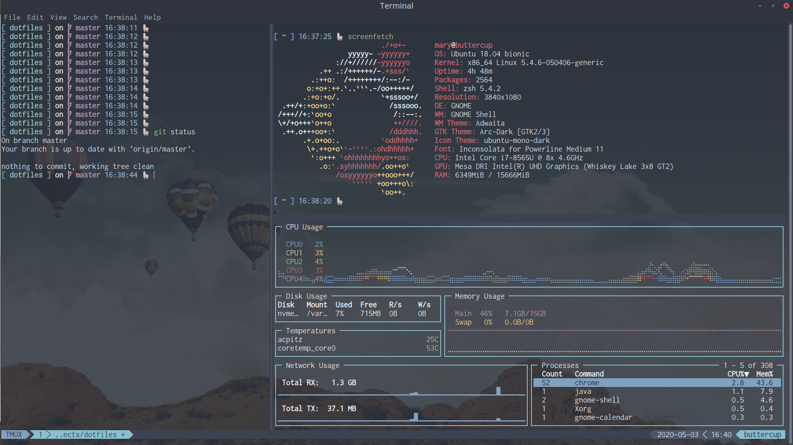

## Explanation

This will replace whatever configuration you have for your terminal.

Script will:
- Install git
- Install neovim through Snap
- Execute [noobs-term](https://noobs-term.com/) [`script`](https://raw.githubusercontent.com/aaronkjones/noobs-term/master/noobs-term.sh)
- Customize noobs-term default installation

## Installation

Execute the [`installer`](installer) from your terminal in order to avoid even having to manually install git!

```bash
bash <(curl -s https://raw.githubusercontent.com/marydn/dotfiles/master/installer)
```

## Setup

1. Press `Ctrl` + `a`, then `I` to load tmux plugins
2. In Gnome terminal preferences, set Nord as your default profile
3. Set an appropriate font (e.g. Inconsolata for Powerline)

## UI Preview:




## Side notes

All commits for this repository were made using:

```bash
git yolo && git push
```

`git yolo` is an alias for git you can check in the [.gifconfig](./git/.gitconfig) file. It will execute:

```bash
!git add -A && git commit -m \"$(curl -s whatthecommit.com/index.txt)\"
```

> [whatthecommit.com](http://whatthecommit.com/) is a web app that generates random commit messages every time you request the index page, so we're getting that random message and using it to create a commit.